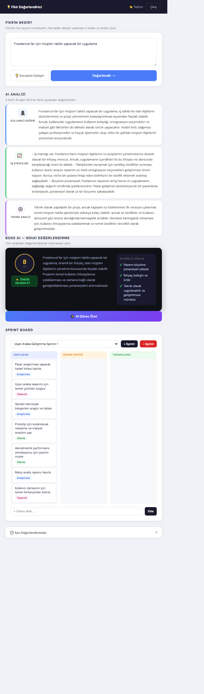

# 🚀 ArguMind AI

> **AI-powered multi-agent debate system for idea validation**



🔗 **Live Demo:**  
👉 https://argumind-ai.onrender.com

---

## 🧠 What is ArguMind AI?

**ArguMind AI** is an AI-powered decision support system that evaluates business and product ideas through structured **multi-agent debate**.

Instead of generating a single answer, the system simulates a **real conflict between different expert perspectives** and produces a final decision.

---

## 🎯 Why ArguMind AI?

Traditional AI systems:
- Generate single, often shallow responses  
- Tend to be overly agreeable  
- Lack critical thinking depth  

**ArguMind AI introduces:**
- Multi-agent reasoning  
- Adversarial debate (agents challenge each other)  
- Role-based intelligence  
- Clear, decision-oriented output  

---

## ⚙️ How It Works

### 1. User submits an idea

Example:
> "AI-powered restaurant automation system"

---

### 2. AI agents analyze from different perspectives

| Agent | Focus |
|------|------|
| 👤 User Agent | Behavior, trust, adoption |
| 📈 Business Agent | Market, revenue, competition |
| ⚙️ Technical Agent | Feasibility, cost, scalability |

---

### 3. Debate phase (core feature)

- Agents **directly challenge each other**
- Arguments are **criticized and broken down**
- New risks are introduced
- No forced agreement

---

### 4. Final Decision (Boss AI)

The system produces a strict decision:

- ✅ **PROCEED**
- 🔄 **PIVOT**
- ❌ **REJECT**

---

### 5. Structured Output

```json
{
  "score": 3.5,
  "decision": "REJECT",
  "summary": "...",
  "strongPoints": ["..."],
  "risks": ["..."],
  "winningAgent": "user",
  "criticalMistake": "..."
}